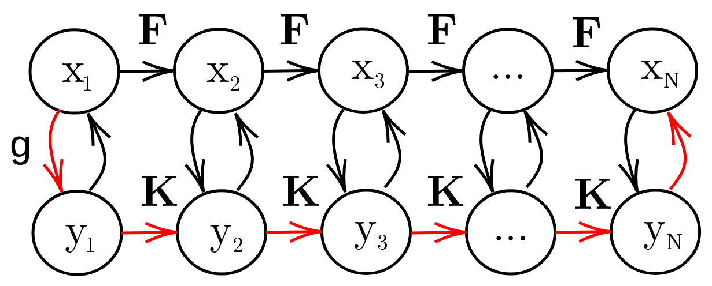

# Koopman Pendulum Tutorials: Learning non-linear dynamics with Koopman operator theory

# Table of contents
1. [Introduction](#introduction)
    1. [What is included in this repository?](#subparagraph11)
    2. [What is *not* included in this repository?](#subparagraph12)
       1. [The Deep Koopman framework](#subparagraph121)   
       1. [Derivations of Koopman operator theory](#subparagraph122)   
2. [What is Koopman operatory theory?](#paragraph1)
    1. [Non-linear dynamical systems](#subparagraph21)
    2. [Deep Koopman Network](#subparagraph22)
3. [Tutorials](#paragraph2)
    1. [Pendulum dynamics outline](#subparagraph30)
    2. [Pendulum (small angle approximation)](#subparagraph31)
    3. [Pendulum](#subparagraph32)
    4. [Double pendulum](#subparagraph33)
    5. [Soft pendulum](#subparagraph34)

## 1. Introduction 
This repository is a collection of notebooks demonstrating analysis of non-linear pendulum dynamics with a Koopman operator theory based deep learning framework. This repository is **not** aimed at teaching you Koopman theory, neither is it an extensive code framework for learning from datasets (as such, code here can likely **not** be run as is). Rather, this is a collection of analyses and evaluations in a specific use-case, to help support the understanding of Koopman operatory theory. 

This document was created to futher explore results published in [^fn0] (arxiv: [^fn00]) for some additional interesting use-cases. This document may be of interest to those studying non-linear dynamical systems, machine learning, or applications such as robotics.

### A. What is included in this repository?  

This repository contains a number of notebooks demonstrating Koopman operatory theory in the context of learning pendulum dynamics. Learning dynamics in this manner can eludicate interesting features of the underlying system, specifically, in contrast to standard deep learning which often lack an intuitive internal physical interpretation, this approch characterises important physics-based structures as part of the learnt model such as functional growths and oscillations. This is a very interesting way to provide physics-based explainations to prediction results, instead of relying purely on error metrics. 

### B. What is *not* included in this repository?  

#### The Deep Koopman framework itself

Learning the non-linear dynamics in a [Koopman operatory theory](#paragraph1) context involves identifying Koopman eigenfunctions using the DeepKoopman Network[^fn1]. The authors provide a deep learning framework (tensorflow) for this paper[^fn2], and a Keras version is avaliable by a third-party [^fn3]. These implementations will not be replicated here, and the interested reader is directory to those repositories for further details.

#### Derivations of Koopman operator theory

Koopman operatory theory is complicated, and detailed derivations are outside of the scope of these tutorials. As the purpose of these notebooks is to illustrate and analyse specific use cases, I would suggest the following materials for understanding this method in depth:

- Komeno, Michael, et. al. Deep Koopman with Control: Spectral Analysis of Soft Robot Dynamics [^fn0], [^fn00] - A recent paper of ours with a concise background explaination of Koopman operatory theory. A first step that should familiarise you with the notation used in this repository.

- Lusch et. al. Deep learning for universal linear embeddings of nonlinear dynamics. [^fn1] - Required reading for this tutorial, outlines the application of Koopman operator theory with deep learning.

- Kutz et. al. Dynamic mode decomposition: Data-driven modeling of complex systems [^cite:kutz] - Dynamic mode decomposition is a data-driven regression method for identifying dynamics, and can be seen as an algorithm for finding Koopman components (in specific cases). This book presents a detailed overview of the foundations of Koopman theory, and is probably the most accessible material.

- Brunton. et. al. Modern Koopman theory for dynamical systems [^cite:bruntonmodern] - Following on from [^cite:kutz], this next reference provides a more detailed explaination of the spectral components of Koopman theory (eigenfunctions etc.).

- (Other tutorials) [^cite:brunton [^cite:geneva]

## 2. What is Koopman operatory theory? 

A short summary of Koopman operator theory is presented here to help contextualise the notebooks. To avoid unnessecary replication, the reader is refered to the background section of [^fn00] for a brief overview of notation, and [the above section](subparagraph121) for more detailed derivations and references. 

### A. Non-linear dynamical systems 
In dynamical systems analysis, a discrete-time dynamical system ofx the state $\bf{x}$ is given as: $\bf{x}_{n+1} = \bf{F}(\bf{x}_x)$.
 
If $\bf{F}$ is linear, modelling these dynamics is relatively easy. However if $\bf{F}$ is non-linear, modelling becomes very difficult.

To address this, Koopman operator theory states we can always find coordinate transformations to map from the non-linear dynamics, to a latent linear dynamical system. Specifically, we describe the dynamics as the linear evolution of *measurement functions* of the non-linear state:

$\mathcal{K}g(\bf{x}_{n}) = g(\bf{F}(\bf{x}_n)) = g(\bf{x}_{n+1})$

where $\mathcal{K}$ is the Koopman operator, an infinite dimensional linear operator, acting on a measurement function $g$.

An intuative way to understand this, is through a visualisation of the connections between the two dynamics systems. This diagram (inspired by [^cite:brunton]) shows that in the state space, state transitions are made using the non-linear transition function $\bf{F}$. However, Koopman theory states that a coordinate transformation (using $g$) can allow us to obtain latent coordinates ($\bf{y}$) that can instead be evolved linearly using the Koopman operator $\bf{K}$. 

### B. Deep Koopman Network 

An infinite dimensional linear operator is not particularly useful for a finite data system. However, the DeepKoopman Network[^fn1] addresses this by instead learning a set of spectral components of the Koopman operator, and using these as an intrinsic measurement coordinate system.

Specifically, $k$ different Koopman eigenfunctions $\bf{\phi}$ and eigenvalues $\lambda$ are learnt. These spectral components are a decomposition of the operator $\mathcal{K}$ satisfying $\mathcal{K}\phi_k = \phi_k \circ \bf{F} = \lambda_k \phi_k$. As such, we don't actually need to learn $\mathcal{K}$ just the eigenfunctions (and eigenvalues). 

These components are then used to create latent coordinates $\bf{y}=\phi(\bf{x})$ where the (linear) dynamics are learnt. Specifically, $\bf{y}$ is the transformation of the state $\bf{x}$ (which evolves non-linearly over time), into a latent state which evolves linearly over time.

## 3. Tutorials 

### A. Pendulum dynamics outline 
- The dynamics of a pendulum are briefly introduced, to highlight the applicability of learning this non-linear dynamics problem with a Koopman operator theory based approach.

### B. Pendulum 
-

[^fn0]: Komeno, Naoto, Brendan Michael, Katharina Küchler, Edgar Anarossi, and Takamitsu Matsubara. "Deep Koopman with Control: Spectral Analysis of Soft Robot Dynamics." 2022 61st Annual Conference of the Society of Instrument and Control Engineers (SICE). IEEE, 2022. https://ieeexplore.ieee.org/abstract/document/9905758/
[^fn00]: https://arxiv.org/pdf/2210.07563.pdf
[^fn1]: Lusch, B., Kutz, J.N. & Brunton, S.L. Deep learning for universal linear embeddings of nonlinear dynamics. Nat Commun 9, 4950 (2018). https://doi.org/10.1038/s41467-018-07210-0
[^fn2]: https://github.com/BethanyL/DeepKoopman
[^fn3]: https://github.com/dykuang/Deep----Koopman
[^cite:kutz]: Kutz, J. Nathan, et al. Dynamic mode decomposition: data-driven modeling of complex systems. Society for Industrial and Applied Mathematics, 2016.
[^cite:brunton]: Brunton, Notes on Koopman Operator Theory https://fluids.ac.uk/files/meetings/KoopmanNotes.1575558616.pdf
[^cite:geneva]: Geneva, Intro to Deep Learning Koopman Operators https://nicholasgeneva.com/deep-learning/koopman/dynamics/2020/05/30/intro-to-koopman.html
[^cite:bruntonmodern] Brunton, Steven L., et al. "Modern Koopman theory for dynamical systems." arXiv preprint arXiv:2102.12086 (2021). https://arxiv.org/abs/2102.12086
